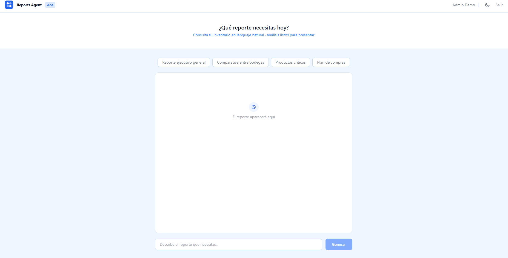

# Inventory A2A Reports — Frontend

React UI for the Inventory Reports Agent. Generates executive inventory reports powered by A2A (Agent-to-Agent) communication between two AI agents. Built with Vite and Tailwind CSS v4.

**[Live Demo](https://reports.nicoleroldan.com)** · **[Reports Agent](https://github.com/nicolerol28/inventory-a2a-reports)** · **[AI Service](https://github.com/nicolerol28/inventory-ai-service)** · **[Backend](https://github.com/nicolerol28/inventory-system-backend)** · **[Chat UI](https://github.com/nicolerol28/inventory-ai-chat)** · **[Inventory Frontend](https://github.com/nicolerol28/inventory-system-frontend)**

> Demo credentials — click **"Probar demo"** on the login page for instant access with pre-seeded data.

>  **Note:** This is a portfolio project. Live demos may be unavailable as services are scaled to zero to manage hosting costs.



---

## Tech Stack

|  |  |
| --- | --- |
| Framework | React 19 + Vite 8 |
| Styling | Tailwind CSS v4 |
| HTTP | Axios |
| Auth | JWT (jwt-decode) — shared with Java backend |
| Deploy | Vercel |

---

## Features

- **Login** — email/password auth against the Java backend + one-click demo access
- **Suggested reports** — four preset chips: executive summary, warehouse comparison, critical products, purchase plan
- **Free-text input** — any custom query in natural language, up to 1000 characters
- **A2A communication** — the Reports Agent queries the Inventory Agent autonomously via the A2A protocol (JSON-RPC 2.0)
- **Dark mode** — toggle with `localStorage` persistence; respects `prefers-color-scheme` on first visit
- **Auto-logout** — Axios interceptor detects 401 and clears the session
- **Env validation** — app throws at startup if required variables are missing

---

## How It Works

```
User → Reports UI → Reports Agent → (A2A) → Inventory Agent → Java Backend
                         ↓
                  Executive report
```

1. User writes a natural language query (or picks a suggested report).
2. The UI sends the query to the **Reports Agent** via `POST /reports`.
3. The Reports Agent communicates with the **Inventory Agent** using the A2A protocol.
4. The Inventory Agent queries the **Java Backend** and returns inventory data.
5. The Reports Agent generates the executive report and returns it to the UI.

---

## Architecture

```
src/
├── api/
│   ├── authClient.js       # Axios client for /auth/login (Java backend)
│   └── reportsClient.js    # Axios client for /reports (Reports Agent) + JWT interceptor
├── hooks/
│   └── useDarkMode.js      # Toggles dark class on <html>, persists in localStorage
├── pages/
│   ├── Login.jsx            # Login form + demo button, always light mode
│   └── Reports.jsx          # Suggested chips, free-text input, report output area
├── App.jsx                  # Root: JWT session management, page routing
├── index.css                # Tailwind v4 imports, dark variant, body colors
└── main.jsx                 # Entry point: validates required env vars at startup
```

| Concern | Approach |
| --- | --- |
| Auth state | `App.jsx` manages JWT in `localStorage`; decoded synchronously at mount with `jwt-decode` to avoid login flash |
| HTTP | Two Axios clients with timeouts — `authClient` (15s) for login, `reportsClient` (60s) for report generation |
| Error handling | Differentiated catch: timeout / network / 429 / server error — each with a specific user message |
| Dark mode | `useDarkMode()` hook toggles Tailwind `dark` class on `<html>` and persists in `localStorage` |
| 401 handling | Axios response interceptor clears token and reloads on unauthorized |

---

## Ecosystem

This project is one of six repositories in the Inventory AI system:

```
inventory-system-frontend      React dashboard           (Vercel)
inventory-ai-chat              Chat UI                   (Vercel)
inventory-a2a-reports-ui       This repo · Reports UI    (Vercel)
inventory-a2a-reports          Reports Agent · Mastra    (Railway)
inventory-ai-service           Inventory Agent · Mastra  (Railway)
inventory-system-backend       Java 17 + Spring Boot     (Railway)
```

---

## Running Locally

```bash
git clone https://github.com/nicolerol28/inventory-a2a-reports-ui
cd inventory-a2a-reports-ui
cp .env.example .env
npm install
npm run dev
```

**Required environment variables:**

```
VITE_API_URL=http://localhost:8080/api/v1
VITE_REPORTS_API_URL=http://localhost:3001
```

**Optional (demo button):**

```
VITE_DEMO_EMAIL=demo@example.com
VITE_DEMO_PASSWORD=demo1234
```
